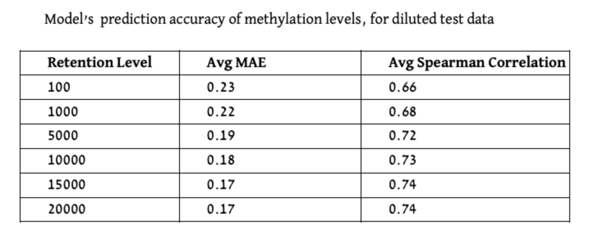

### Mentors: The project mentored and supervised by Prof. Zohar Yakhini and Alona Levy-Jurgenson, a PhD student at the Yakhini Research Group.

## Abstract

DNA methylation plays a pivotal role in gene expression regulation. In this study, we replicate and extend the paper by [Levy-Jurgenson et al.](https://link.springer.com/chapter/10.1007/978-3-030-18174-1_13) deep learning model for predicting DNA methylation at specific CpG positions based on a sample’s gene expression profile and the surrounding sequence. We meticulously reconstructed the data preparation process and implemented their model in the PyTorch environment. Our analysis successfully reproduces the original model's results, affirming its validity and accuracy while improving accessibility and reproducibility. Furthermore, we examined the model's predictions on diluted gene expression data, exploring various retention levels of gene expression information. Our findings demonstrate that even in scenarios with significantly diluted gene expression data, the model can extract meaningful insights, highlighting its robustness and practical potential for single-cell analysis, and spatial sample utilization.

## DNA Methylation

DNA methylation is a chemical process that modifies DNA in living organisms and can significantly affect gene expression, mostly through the inhibition of transcription. In humans, DNA methylation refers to the presence of a methyl group at a defined position of a cytosine and occurs in CpG dinucleotides. It has been particularly shown to affect gene expression in gene promoter regions with relatively dense CpGs, known as CpG islands (CGI). When a large number of proximal CpGs are methylated, the transcription of nearby downstream genes may be inhibited. 
DNA methylation has been extensively linked to alterations in gene expression, playing a key role in the manifestation and pathogenesis of multiple diseases, such as cancer. Hence, the sequence determinants of methylation and the relationship between methylation and expression are of great interest from a biological perspective.

Data structure of the four data parts, including an illustration of the train validation and test separation. The test set consists of subjects/samples and CpGs that have not been included in the train or validation set. The association of each subject and CpG to either one of the train, validation or test sets, was random.

## The Original Paper
In the research paper titled "Predicting Methylation from Sequence and Gene Expression Using Deep Learning with Attention" by Levy-Jurgenson et al. , the relationship between DNA methylation and gene expression was explored while also taking into account the sequence context. The authors harnessed the power of deep learning, integrating an attention mechanism, to create a versatile model capable of predicting DNA methylation patterns at individual CpG positions solely based on gene expression profiles and the nucleotide sequence surrounding the CpG sites. This approach yielded impressive Spearman correlation and Mean Absolute Error (MAE) results on a diverse set of CpG positions and subjects, and it also revealed potential associations between methylation activity and specific motifs and genes, such as Nodal and Hand1. Moreover, the use of attention mechanisms offered a fresh perspective on deriving insights from gene expression data, especially when combined with sequence information.

## The Data
In this initial phase, we reconstructed the datasets required for training and validating our model, adhering closely to the methodology outlined in the paper. The core datasets utilized include gene expression and methylation level data from patients with BRCA and LUAD conditions, coupled with essential human genome, CpG locations, and gene locations data.
Leveraging this raw information, we generated four data files, their structure is demonstrated in the image below: 

1. Sequences Centered around Each CpG Site
2. Distances between CpG Sites and Genes
3. Gene Expression Per Subject
4. Methylation Level Data Per Sample and CpG Site

For an in-depth understanding of our data preparation process, including associated documents and code, refer to the  [Data Preparation Documentation](https://github.com/YakhiniGroup/Spatial_DNA_Methylation_AD/blob/5d06821a9bbe25b9780be3cef9ba480a5991fd5a/docs/CH3%20Data%20Preparation%20Documentation.pdf)

Visualization of a subset of the gene expression data, in different retention levels. The rows represent an arbitrary selection of samples, and the columns represent an arbitrary selection of genes. Each graph depicts a heatmap of the gene expression data at the indicated retention level. The colors represent the gene expression levels after the dilution process.

## Our Work & Research

### The Pytourch reconstructed model

This part of the project involves implementing the model in PyTorch and reproducing the results achieved in the paper using our own code. 
To confirm the validity of each step, we first replicated the original model's performance using our dataset and the original TensorFlow implementation.
Then, we proceeded to train and test our PyTorch model using our dataset, successfully reproducing the results at this stage as well.
To access the model code and instructions with the training and validation environment, please visit the [Model Code Repository](https://github.com/YakhiniGroup/Spatial_DNA_Methylation_AD/tree/5d06821a9bbe25b9780be3cef9ba480a5991fd5a/src).

### Dilution Test: Evaluating Spatial Methylation Prediction

Although several models have been suggested to support the prediction of methylation status, these models were never tested on spatial data or single cell data. The greater vision that forms the context of this project is the extension of these methods to be applicable to such challenging samples. In this project we present the first step of predicting DNA methylation patterns at individual CpG positions using diluted gene expression data. 

As single cell and spatial samples are in effect diluted versions of the actual gene expression profile, we focused on studying diluted input, also in other contexts. We describe the investigation of the performance of MNIST Fashion classifier, on diluted images and then continue to predict DNA methylation at individual CpG sites from diluted gene expression data and the surrounding sequence.

For a comprehensive insight into the dilution test results and associated performance graphs, please explore the [Dilution Test Results](https://github.com/YakhiniGroup/Spatial_DNA_Methylation_AD/blob/5d06821a9bbe25b9780be3cef9ba480a5991fd5a/docs/Predicting%20DNA%20Methylation%20at%20individual%20CpG%20sites%20from%20diluted%20gene%20expression%20data%20and%20site%20context.pdf).

## Methods

Our first step consists of implementing the model in PyTorch and reproducing the results achieved in "Predicting Methylation from Sequence and Gene Expression Using Deep Learning with Attention" by Levy-Jurgenson et al. To access the model code and instructions with the training and validation environment visit the Model Code Repository.

For the dilution data experiments, to simulate gene expression data that is typical for spatial samples, we introduced a random dilution process to the gene expression test data, wherein the strength of gene expression per sample, serves as the probability of a gene's inclusion in the sample's diluted data. The selection process is as follows: The retention level required, acts as the number of times we conduct the random selection of a gene to be included in the gene expression list for a specific sample, the selection function can choose a certain gene more then once, as we sample with replacement. The probability for a gene to be selected is the gene expression fraction out of the gene expression sum of the sample. We conducted this procedure for multiple retention levels: 20,000, 15,000, 10,000, 5000, 1000, and 100 genes. In Figure 5, we visually depict the persistence of gene expression information across different retention levels. The figure clearly shows that even with a reduction to 10,000 or 5,000 selected genes, the essential information and prominent patterns remain discernible, although with somewhat reduced intensity. 

Visualization of a subset of the gene expression data, in different retention levels. The rows represent an arbitrary selection of samples, and the columns represent an arbitrary selection of genes. Each graph depicts a heatmap of the gene expression data at the indicated retention level. The colors represent the gene expression levels after the dilution process.

## Results

### The Pytourch reconstructed model

We evaluated both models on held-out test sets in which both CpGs and Samples are disjoint to the ones included in the training. The reported results in [1] are: MAE of 0.14 and 0.8 Spearman correlation. In our reproduction experiments (with the new data) we obtained the following results. When utilizing the original Tensorflow model, we achieved MAE of 0.173 and 0.740 Spearman correlation, and with our new PyTorch model MAE of 0.167 and 0.742 Spearman correlation.

### Predicting Methylation levels for diluted data

The middle retention levels, the model's results exhibit higher variance, while for the lowest and highest retention levels, the distribution appears notably more compressed. For more insight into the dilution test code please explore the Dilution Test Code and Report.


Training graphs of the PyTorch model, trained with the reconstructed data. The metrics presented in the graphs are Spearman Correlation (left) and the Mean Absolute Error (MAE) loss (right).

Training graphs of the PyTorch model, trained with the reconstructed data. The metrics presented in the graphs are Spearman Correlation (left) and the Mean Absolute Error (MAE) loss (right).

## Consclusions
The experiments conducted using diluted gene expression data clearly illustrate the remarkable potential for predictability even when dealing with partial or diluted datasets. Specifically, when transitioning from the complete gene expression set to a subset of chosen 5,000 genes, the effect on the model’s prediction capability remained relatively modest.

The results underscore the model's ability to extract meaningful insights from highly diluted data, reaffirming its robustness and potential for practical application.In particular, our results lay solid foundation to continued work with single cell and spatial transcriptomics data.

For inquiries or support please reach out to agotliber@gmail.com or keydar.dana@gmail.com
